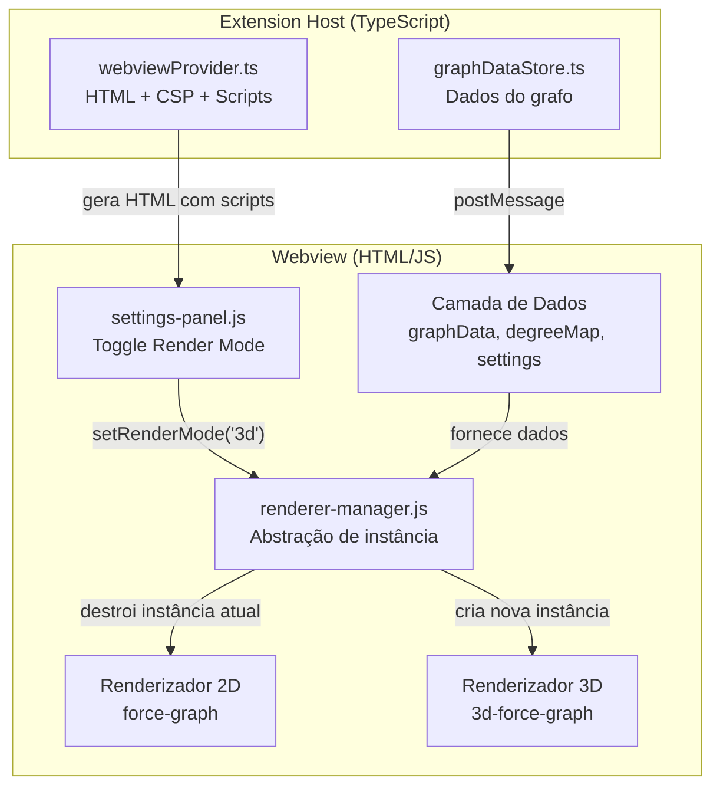
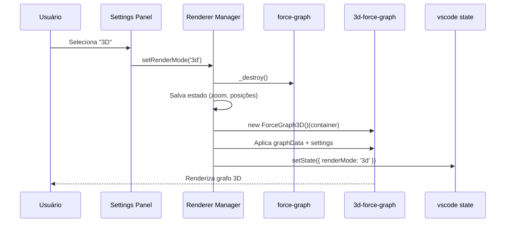
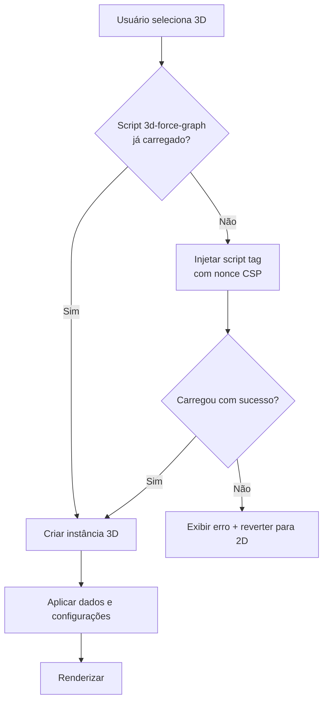

# Documento de Design — Modo 3D do Ecosystem Graph

## Visão Geral

Este documento descreve a arquitetura e o design técnico para adicionar um modo de visualização 3D ao Kiro Ecosystem Graph. A solução utiliza a biblioteca `3d-force-graph` (do mesmo autor da `force-graph` atual) que encapsula Three.js/WebGL, mantendo compatibilidade de API com o renderizador 2D existente.

A abordagem central é uma **arquitetura de renderizador dual** onde ambos os modos compartilham a mesma camada de dados (nós, arestas, graus, filtros, configurações de força) e a alternância entre modos destrói a instância atual e recria com a biblioteca correspondente.

### Decisões de Design

| Decisão | Justificativa |
|---------|---------------|
| Lazy loading da lib 3D | Evita carregar ~500KB de Three.js quando o usuário usa apenas 2D |
| Destruir/recriar instância na troca | APIs quase idênticas, mas internamente incompatíveis (Canvas2D vs WebGL context) |
| Persistência via vscode state | Padrão existente no projeto, sem dependência externa |
| Fallback automático para 2D | WebGL pode não estar disponível em todos os ambientes |
| Geometrias diferenciadas por tipo | Mantém a estética neural e facilita identificação visual em 3D |

## Arquitetura

### Diagrama de Componentes



### Fluxo de Alternância de Modo



### Fluxo de Carregamento Lazy



## Componentes e Interfaces

### 1. renderer-manager.js (novo arquivo)

Módulo responsável por gerenciar o ciclo de vida das instâncias de renderização. Expõe uma interface unificada para que `webview.js` e os painéis interajam com o grafo sem saber qual renderizador está ativo.

```javascript
/**
 * Interface pública do Renderer Manager
 */
var RendererManager = {
  /** @type {'2d'|'3d'} Modo atual */
  currentMode: '2d',

  /** @type {object|null} Instância ativa (ForceGraph ou ForceGraph3D) */
  instance: null,

  /**
   * Inicializa o renderizador com o modo salvo ou padrão (2D).
   * @param {HTMLElement} container - Elemento DOM #graph
   * @param {object} graphData - { nodes: [], links: [] }
   * @param {object} settings - Configurações de força e exibição
   */
  init(container, graphData, settings) {},

  /**
   * Alterna entre modos. Destrói instância atual, cria nova.
   * @param {'2d'|'3d'} mode
   * @returns {Promise<boolean>} true se sucesso, false se fallback
   */
  async setMode(mode) {},

  /**
   * Atualiza dados do grafo na instância ativa.
   * @param {object} graphData - { nodes: [], links: [] }
   */
  updateData(graphData) {},

  /**
   * Aplica uma configuração de força à instância ativa.
   * @param {string} key - Nome da configuração (ex: 'repulsionForce')
   * @param {*} value - Valor
   */
  applySetting(key, value) {},

  /**
   * Retorna se o modo atual é 3D.
   * @returns {boolean}
   */
  is3D() {},

  /**
   * Destrói a instância atual e libera recursos.
   */
  destroy() {}
};
```

### 2. Modificações em settings-panel.js

Adição de um controle de alternância "Render Mode" na seção "Display":

```javascript
// Novo controle no buildPanelHTML(), seção Display
buildRenderModeRow()

function buildRenderModeRow() {
  return [
    '<div class="setting-row setting-row-radio">',
    '<span class="setting-label">Render Mode</span>',
    '<div class="radio-group">',
    '<label class="radio-option"><input type="radio" name="renderMode" value="2d" checked /> 2D</label>',
    '<label class="radio-option"><input type="radio" name="renderMode" value="3d" /> 3D</label>',
    '</div>',
    '</div>',
  ].join('');
}
```

### 3. Modificações em webviewProvider.ts

- Adicionar URI para o script `3d-force-graph` (lazy, não incluído no HTML inicial)
- Adicionar URI para `renderer-manager.js`
- Atualizar CSP para permitir WebGL:

```typescript
// CSP atualizada
`default-src 'none'; 
 script-src 'nonce-${nonce}' ${webview.cspSource}; 
 style-src 'unsafe-inline' ${webview.cspSource}; 
 img-src ${webview.cspSource} data: blob:;`
```

A diretiva `img-src blob:` é necessária para texturas Three.js. Não é necessário `worker-src` pois `3d-force-graph` não usa Web Workers.

### 4. Renderização 3D — Configuração de Nós

```javascript
/**
 * Configura a aparência dos nós no modo 3D.
 * Usa Three.js geometries via nodeThreeObject callback.
 */
function configure3DNodes(instance) {
  instance.nodeThreeObject(node => {
    var geometry = getGeometryForType(node.type);
    var color = COLOR_MAP[node.type] || COLOR_MAP['unknown'];
    var material = new THREE.MeshLambertMaterial({
      color: color,
      emissive: color,
      emissiveIntensity: 0.4,
      transparent: true,
      opacity: 0.9
    });
    var mesh = new THREE.Mesh(geometry, material);
    var size = getNodeSize(node) * settings.nodeSizeMultiplier;
    mesh.scale.set(size, size, size);
    return mesh;
  });
}

/**
 * Retorna a geometria Three.js baseada no tipo do nó.
 */
function getGeometryForType(type) {
  if (type && type.startsWith('steering')) return new THREE.OctahedronGeometry(1);
  if (type && type.startsWith('hook'))     return new THREE.TetrahedronGeometry(1);
  if (type === 'skill')                    return new THREE.DodecahedronGeometry(1);
  return new THREE.SphereGeometry(1, 16, 12); // padrão
}
```

### 5. Labels como Billboard Sprites

```javascript
/**
 * Configura labels que sempre encaram a câmera (billboard).
 * Usa SpriteText da lib three-spritetext (bundled com 3d-force-graph).
 */
function configure3DLabels(instance) {
  instance.nodeLabel(node => ''); // desabilita tooltip nativo
  instance.nodeThreeObject(node => {
    // ... mesh do nó + sprite de texto
    var sprite = new SpriteText(node.name || node.id);
    sprite.color = '#ffffff';
    sprite.textHeight = 2;
    sprite.position.y = getNodeSize(node) + 2;
    var group = new THREE.Group();
    group.add(mesh);
    group.add(sprite);
    return group;
  });
}
```

### 6. Mapeamento de Funcionalidades 2D → 3D

| Funcionalidade | 2D | 3D | Notas |
|---|---|---|---|
| Filtros de tipo | Sim | Sim | Mesma lógica, filtra graphData antes de passar |
| Configurações de força | Sim | Sim | API idêntica (d3Force) |
| Tooltip no hover | Canvas custom | nodeLabel() ou CSS overlay | Adaptar para raycasting |
| Click → openFile | onNodeClick | onNodeClick | API idêntica |
| Highlight propagation | Canvas custom | nodeColor/linkColor dinâmico | Recalcula cores |
| Partículas nas arestas | linkDirectionalParticles | linkDirectionalParticles | API nativa em ambos |
| Brain silhouette | Canvas 2D path | N/A (2D only) | Não faz sentido em 3D |
| Ambient particles | Canvas 2D custom | N/A (2D only) | Substituído por profundidade 3D |
| Labels | Canvas drawText | SpriteText billboard | Sempre encaram câmera |
| Legenda | HTML overlay | HTML overlay | Sem mudança |
| Stats panel | HTML overlay | HTML overlay | Sem mudança |
| Zoom slider | zoom() API | cameraPosition() | Adaptar controle |

## Modelos de Dados

### Estado Compartilhado (Camada de Dados)

Nenhuma alteração na estrutura de dados existente. Ambos os renderizadores consomem o mesmo formato:

```typescript
interface GraphData {
  nodes: GraphNode[];
  links: GraphLink[];
}

interface GraphNode {
  id: string;
  name: string;
  type: string;       // 'steering-flow' | 'skill' | 'hook-auto' | ...
  path?: string;
  mtime?: number;
  lineCount?: number;
  x?: number;
  y?: number;
  z?: number;         // NOVO: coordenada Z (usado apenas em 3D, ignorado em 2D)
}

interface GraphLink {
  source: string;
  target: string;
  weight?: number;
}
```

### Estado do Renderer Manager

```typescript
interface RendererState {
  renderMode: '2d' | '3d';          // Modo ativo
  is3DLibLoaded: boolean;            // Se o script já foi injetado
  lastCameraPosition?: {             // Posição da câmera 3D (para restaurar)
    x: number;
    y: number;
    z: number;
  };
}
```

### Persistência (vscode state)

O estado persistido via `vscode.getState()`/`setState()` ganha um novo campo:

```typescript
interface PersistedState {
  // ... campos existentes ...
  renderMode: '2d' | '3d';          // NOVO: modo de renderização selecionado
}
```

### Mapeamento Tipo → Geometria 3D

```typescript
const GEOMETRY_MAP: Record<string, string> = {
  'steering-*':  'OctahedronGeometry',   // Octaedro para steerings
  'hook-*':      'TetrahedronGeometry',   // Tetraedro para hooks
  'skill':       'DodecahedronGeometry',  // Dodecaedro para skills
  'default':     'SphereGeometry'         // Esfera para demais
};
```


## Propriedades de Corretude

*Uma propriedade é uma característica ou comportamento que deve ser verdadeiro em todas as execuções válidas de um sistema — essencialmente, uma declaração formal sobre o que o sistema deve fazer. Propriedades servem como ponte entre especificações legíveis por humanos e garantias de corretude verificáveis por máquina.*

### Propriedade 1: Round-trip de alternância de modo

*Para qualquer* modo de renderização ativo (2D ou 3D), alternar para o outro modo e depois retornar ao modo original deve resultar em um estado de renderização equivalente ao inicial (mesmo modo, mesma instância funcional).

**Valida: Requisitos 1.2, 1.3**

### Propriedade 2: Preservação de dados na troca de modo

*Para qualquer* conjunto de dados do grafo (nós, arestas, filtros ativos, configurações de força), alternar o modo de renderização não deve alterar a camada de dados — os arrays de nós e arestas, o mapa de graus e as configurações devem permanecer idênticos antes e depois da troca.

**Valida: Requisito 1.5**

### Propriedade 3: Round-trip de persistência do modo

*Para qualquer* modo de renderização válido ('2d' ou '3d'), persistir via `setState()` e restaurar via `getState()` deve retornar o mesmo valor de modo.

**Valida: Requisito 1.6**

### Propriedade 4: Propriedades visuais do nó correspondem ao tipo

*Para qualquer* nó com um tipo definido no COLOR_MAP, a renderização 3D deve produzir um objeto com: (a) cor do material igual a COLOR_MAP[tipo], (b) intensidade emissiva > 0 (glow), e (c) geometria correspondente ao mapeamento definido (octaedro para steerings, tetraedro para hooks, esfera para demais).

**Valida: Requisitos 3.1, 3.2, 3.3**

### Propriedade 5: Aplicação correta de filtros

*Para qualquer* conjunto de filtros de tipo ativos e qualquer conjunto de nós no grafo, os nós visíveis após aplicação dos filtros devem conter apenas nós cujo tipo está incluído nos filtros ativos — independente do modo de renderização (2D ou 3D).

**Valida: Requisito 4.1**

### Propriedade 6: Tooltip contém campos obrigatórios

*Para qualquer* nó do grafo que possua name, type e path definidos, o conteúdo gerado para o tooltip deve conter todos os três valores (nome, tipo e caminho do arquivo).

**Valida: Requisito 4.2**

### Propriedade 7: Click em nó dispara mensagem openFile

*Para qualquer* nó do grafo que possua um path definido, o handler de click deve produzir uma mensagem com `type: 'openFile'` e `filePath` igual ao path do nó.

**Valida: Requisito 4.3**

### Propriedade 8: Propagação de highlight correta

*Para qualquer* nó do grafo e qualquer conjunto de arestas, ao selecionar um nó para highlight, o conjunto de nós destacados deve ser exatamente o conjunto de nós diretamente conectados ao nó selecionado (adjacência de primeiro grau), e o conjunto de arestas destacadas deve ser exatamente as arestas que conectam o nó selecionado aos seus vizinhos.

**Valida: Requisito 4.5**

### Propriedade 9: Visibilidade de labels segue labelMode

*Para qualquer* configuração de labelMode ('on', 'off', 'auto') e qualquer nível de zoom, a visibilidade dos labels deve seguir: 'on' = sempre visível, 'off' = nunca visível, 'auto' = visível apenas quando zoom > LABEL_ZOOM_THRESHOLD.

**Valida: Requisito 4.6**

### Propriedade 10: Configurações de força aplicadas sem recriar instância

*Para qualquer* chave de configuração de força (centerForce, repulsionForce, linkForce, linkDistance) e qualquer valor válido dentro do range do slider, aplicar a configuração deve atualizar o parâmetro na simulação ativa sem destruir/recriar a instância do grafo (a referência do objeto permanece a mesma).

**Valida: Requisitos 7.1, 7.2, 7.3, 7.4, 7.5**

## Tratamento de Erros

### Falha na inicialização WebGL

| Cenário | Detecção | Ação |
|---------|----------|------|
| WebGL não disponível | `try/catch` ao criar instância 3D | Exibir mensagem informativa, reverter para 2D |
| Script 3d-force-graph falha ao carregar | `onerror` no script tag | Exibir erro, manter modo 2D, desabilitar opção 3D |
| Contexto WebGL perdido | Evento `webglcontextlost` | Exibir aviso, pausar renderização, tentar restaurar |

### Implementação do Fallback

```javascript
async function switchTo3D() {
  try {
    await loadScript3D(); // lazy load
    var instance = ForceGraph3D()(container);
    // ... configurar
    return instance;
  } catch (err) {
    showErrorMessage('Não foi possível inicializar o modo 3D: ' + err.message);
    revertTo2D();
    return null;
  }
}
```

### Limpeza de Memória na Troca de Modo

```javascript
function destroyInstance(instance, mode) {
  if (!instance) return;
  if (mode === '3d') {
    // Three.js requer dispose explícito
    instance.scene().traverse(obj => {
      if (obj.geometry) obj.geometry.dispose();
      if (obj.material) {
        if (Array.isArray(obj.material)) {
          obj.material.forEach(m => m.dispose());
        } else {
          obj.material.dispose();
        }
      }
    });
    instance.renderer().dispose();
  }
  instance._destructor && instance._destructor();
}
```

### Erros de Estado

| Cenário | Prevenção |
|---------|-----------|
| Duplo click rápido no toggle | Desabilitar controle durante transição (flag `isSwitching`) |
| Dados corrompidos no state | Validar `renderMode` ao restaurar — se inválido, usar '2d' |
| Container DOM removido | Verificar existência do container antes de criar instância |

## Estratégia de Testes

### Abordagem Dual

A estratégia combina testes unitários (exemplos específicos e edge cases) com testes baseados em propriedades (validação universal):

- **Testes unitários**: Verificam exemplos concretos, configurações iniciais, edge cases e integração entre componentes
- **Testes de propriedade**: Verificam invariantes universais que devem valer para qualquer entrada válida

### Biblioteca de Property-Based Testing

- **Biblioteca**: `fast-check` ^3.15.0 (já presente no projeto como devDependency)
- **Configuração**: Mínimo 100 iterações por teste de propriedade
- **Runner**: Mocha (já configurado no projeto)

### Testes Unitários

| Teste | Tipo | Arquivo |
|-------|------|---------|
| Render mode toggle existe no HTML do painel | Exemplo | `settings-panel.test.ts` |
| Modo padrão é '2d' quando sem estado salvo | Exemplo | `renderer-manager.test.ts` |
| Background color é #0d0d0d no modo 3D | Exemplo | `renderer-manager.test.ts` |
| Partículas direcionais configuradas no modo 3D | Exemplo | `renderer-manager.test.ts` |
| Fallback para 2D quando WebGL falha | Edge case | `renderer-manager.test.ts` |
| Controles orbitais sem restrição angular | Exemplo | `renderer-manager.test.ts` |
| Script 3D carregado com nonce CSP válido | Exemplo | `webviewProvider.test.ts` |

### Testes de Propriedade

Cada teste de propriedade referencia a propriedade do design:

| Propriedade | Tag | Arquivo |
|-------------|-----|---------|
| 1: Round-trip de modo | Feature: ecosystem-graph-3d-mode, Property 1: mode switch round-trip | `renderer-manager.property.ts` |
| 2: Preservação de dados | Feature: ecosystem-graph-3d-mode, Property 2: data preservation on mode switch | `renderer-manager.property.ts` |
| 3: Persistência round-trip | Feature: ecosystem-graph-3d-mode, Property 3: render mode persistence round-trip | `renderer-manager.property.ts` |
| 4: Visuais por tipo | Feature: ecosystem-graph-3d-mode, Property 4: node visual properties match type | `node-rendering.property.ts` |
| 5: Filtros | Feature: ecosystem-graph-3d-mode, Property 5: filter application correctness | `graph-filters.property.ts` |
| 6: Tooltip | Feature: ecosystem-graph-3d-mode, Property 6: tooltip contains required fields | `tooltip.property.ts` |
| 7: Click openFile | Feature: ecosystem-graph-3d-mode, Property 7: node click triggers openFile | `node-click.property.ts` |
| 8: Highlight | Feature: ecosystem-graph-3d-mode, Property 8: highlight propagation correctness | `highlight.property.ts` |
| 9: Labels | Feature: ecosystem-graph-3d-mode, Property 9: label visibility follows labelMode | `labels.property.ts` |
| 10: Forças sem recriar | Feature: ecosystem-graph-3d-mode, Property 10: force settings applied without recreation | `force-settings.property.ts` |

### Configuração dos Testes de Propriedade

```typescript
import * as fc from 'fast-check';

// Exemplo: Propriedade 2 — Preservação de dados
// Feature: ecosystem-graph-3d-mode, Property 2: data preservation on mode switch
describe('Renderer Manager - Property Tests', () => {
  it('preserva dados do grafo ao alternar modo', () => {
    fc.assert(
      fc.property(
        fc.array(fc.record({
          id: fc.string({ minLength: 1 }),
          name: fc.string(),
          type: fc.constantFrom('steering-flow', 'skill', 'hook-auto', 'code-file'),
          path: fc.string()
        }), { minLength: 1, maxLength: 50 }),
        (nodes) => {
          const graphData = { nodes, links: [] };
          rendererManager.updateData(graphData);
          rendererManager.setMode('3d');
          const afterSwitch = rendererManager.getData();
          return deepEqual(graphData.nodes, afterSwitch.nodes);
        }
      ),
      { numRuns: 100 }
    );
  });
});
```

### Estrutura de Arquivos de Teste

```
src/test/
  renderer-manager.test.ts       — Testes unitários do gerenciador
  renderer-manager.property.ts   — Propriedades 1, 2, 3, 10
  node-rendering.property.ts     — Propriedade 4
  graph-filters.property.ts      — Propriedade 5
  tooltip.property.ts            — Propriedade 6
  node-click.property.ts         — Propriedade 7
  highlight.property.ts          — Propriedade 8
  labels.property.ts             — Propriedade 9
  force-settings.property.ts     — Propriedade 10 (alternativo)
```
