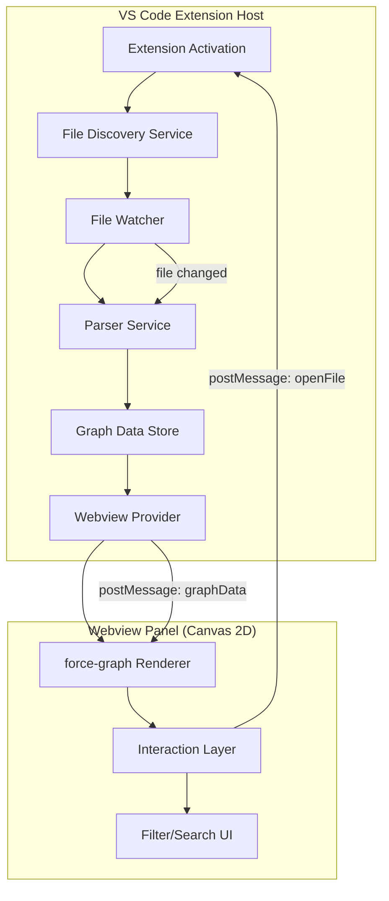

# Design Document: Ecosystem Graph Extension

## Overview

A extensao Ecosystem Graph e um VS Code/Kiro extension que parseia steering files (`.kiro/steering/*.md`) de todos os workspace folders de um multi-root workspace e renderiza um grafo interativo force-directed em um webview panel. O grafo mostra as conexoes entre steerings, arquivos de codigo, modulos e entidades do ecossistema.

A extensao e escrita em TypeScript, usa a VS Code Extension API para descoberta de arquivos e file watching, e renderiza o grafo usando `force-graph` (wrapper leve sobre d3-force com canvas 2D) no webview. Toda a logica roda localmente, sem dependencias externas ou rede.

A extensao e 100% generica — funciona com qualquer workspace que tenha `.kiro/steering/*.md`. Nenhuma referencia a projetos especificos no codigo-fonte. Pode ser reutilizada em qualquer time/codebase sem modificacao.

### Decisoes de Design

- **force-graph** em vez de d3 puro: API mais simples, performance melhor com canvas 2D, suporte nativo a zoom/pan/drag, bundle menor (~50KB)
- **Canvas 2D** em vez de SVG: melhor performance para 200+ nodes, menos overhead de DOM
- **Incremental parsing**: re-parseia apenas o arquivo alterado, atualiza o grafo in-place sem rebuild completo
- **Regex-based parser**: steering files sao markdown simples, nao precisa de AST parser completo — regex cobre todos os formatos de referencia
- **Backtick validation**: backtick refs so geram edges se o nome bater com um steering file descoberto — evita ruido de exemplos de codigo
- **Node sizing by degree**: nodes com mais conexoes ficam maiores, dando nocao visual de importancia/centralidade
- **Visual "neural network"**: fundo preto, nos com glow, links semi-transparentes, animacao continua — visual de sistema cognitivo vivo, inspirado no Obsidian graph view e visualizacoes de redes neurais

## Architecture



### Fluxo de Dados

1. Na ativacao, o File Discovery Service escaneia todos os workspace folders por `.kiro/steering/*.md`
2. O Parser Service extrai referencias de cada arquivo descoberto
3. O Graph Data Store mantem o modelo de nodes/edges em memoria
4. O Webview Provider serializa o grafo e envia via `postMessage` ao webview
5. O force-graph renderiza o layout no canvas
6. Interacoes do usuario (click, hover, filter) sao tratadas no webview e comunicadas ao extension host via `postMessage`

## Components and Interfaces

### 1. FileDiscoveryService

Responsavel por encontrar todos os steering files no workspace.

```typescript
interface FileDiscoveryService {
  discoverAll(): Promise<SteeringFile[]>;
  watchForChanges(callback: (event: FileChangeEvent) => void): vscode.Disposable;
}

interface SteeringFile {
  uri: vscode.Uri;
  workspaceFolder: string; // "Workspace", "API", "Mobile", etc.
  relativePath: string;
}

interface FileChangeEvent {
  type: 'created' | 'changed' | 'deleted';
  file: SteeringFile;
}
```

### 2. ParserService

Extrai referencias e metadados de steering files.

```typescript
interface ParserService {
  parse(file: SteeringFile, content: string, knownSteeringFiles: string[]): ParseResult;
}
```

O parametro `knownSteeringFiles` e a lista de nomes de arquivos descobertos pelo FileDiscoveryService. Backtick refs so geram edges se o nome estiver nessa lista.

interface ParseResult {
  node: GraphNode;
  references: Reference[];
}

interface Reference {
  source: string;       // path do arquivo fonte
  target: string;       // path do arquivo alvo
  type: ReferenceType;  // tipo de referencia encontrada
  line: number;         // linha onde a referencia aparece
}

type ReferenceType = 'wiki-link' | 'markdown-link' | 'backtick-ref' | 'table-path';
```

### 3. GraphDataStore

Mantem o estado do grafo em memoria com suporte a updates incrementais.

```typescript
interface GraphDataStore {
  getNodes(): GraphNode[];
  getEdges(): GraphEdge[];
  upsertFile(result: ParseResult): void;
  removeFile(filePath: string): void;
  getSerializableGraph(): SerializedGraph;
}

interface GraphNode {
  id: string;           // path relativo unico
  label: string;        // nome do arquivo sem extensao
  type: NodeType;
  workspaceFolder: string;
  filePath: string;
  resolved: boolean;    // false se o arquivo nao existe no disco
  metadata?: {
    inclusion?: string; // always, auto, fileMatch, manual
  };
}

type NodeType = 
  | 'steering-flow' 
  | 'steering-help' 
  | 'steering-playbook' 
  | 'steering-observability' 
  | 'steering-domain'
  | 'code-file' 
  | 'module' 
  | 'entity' 
  | 'unknown';

interface GraphEdge {
  source: string;  // node id
  target: string;  // node id
  type: ReferenceType;
}

interface SerializedGraph {
  nodes: GraphNode[];
  edges: GraphEdge[];
}
```

### 4. WebviewProvider

Gerencia o webview panel e a comunicacao bidirecional.

```typescript
interface EcosystemGraphProvider extends vscode.WebviewViewProvider {
  show(): void;
  updateGraph(graph: SerializedGraph): void;
}

// Messages: Extension -> Webview
type ExtensionMessage = 
  | { type: 'updateGraph'; data: SerializedGraph }
  | { type: 'highlightNode'; nodeId: string };

// Messages: Webview -> Extension
type WebviewMessage = 
  | { type: 'openFile'; filePath: string }
  | { type: 'ready' }
  | { type: 'stateChanged'; state: PanelState };

interface PanelState {
  zoom: number;
  panX: number;
  panY: number;
  filters: FilterState;
  settings: GraphSettings;
}

interface FilterState {
  searchText: string;
  visibleTypes: NodeType[];
  visibleFolders: string[];
}

interface GraphSettings {
  centerForce: number;       // 0 - 0.2, default 0.05
  repulsionForce: number;    // -300 - 0, default -150
  linkForce: number;         // 0 - 1, default 0.3
  linkDistance: number;       // 20 - 200, default 60
  nodeSizeMultiplier: number; // 0.5 - 3, default 1
  linkWidth: number;          // 0.1 - 3, default 0.5
  showArrows: boolean;        // default false
  labelMode: 'on' | 'off' | 'auto'; // default 'auto'
  showOnlyExisting: boolean;  // default false
  showOrphans: boolean;       // default true
}
```

### 5. NodeClassifier

Determina o tipo de um node baseado no nome do arquivo e workspace folder.

```typescript
interface NodeClassifier {
  classify(fileName: string, workspaceFolder: string): NodeType;
}
```

Regras de classificacao:
- `flow-*` → `steering-flow`
- `help-*` → `steering-help`
- `playbook*` → `steering-playbook`
- `observability-*` → `steering-observability`
- `*-dominio*` ou `*-domain*` → `steering-domain`
- Arquivos em workspace folders (API, Integrador, Mobile, Manifests) referenciados por steerings → `code-file`
- Fallback → `unknown`

## Data Models

### Node Color Scheme

| NodeType | Color | Hex |
|----------|-------|-----|
| steering-flow | Azul | #4A9EFF |
| steering-help | Verde | #4CAF50 |
| steering-playbook | Laranja | #FF9800 |
| steering-observability | Roxo | #9C27B0 |
| steering-domain | Teal | #009688 |
| code-file | Cinza claro | #90A4AE |
| module | Amarelo | #FFC107 |
| entity | Rosa | #E91E63 |
| unknown | Cinza | #607D8B |

### Regex Patterns para Parsing

```typescript
const PATTERNS = {
  // #[[file:path/to/file.md]]
  wikiLink: /#\[\[file:([^\]]+)\]\]/g,
  
  // [text](path/to/file.md) - exclui URLs http/https
  markdownLink: /\[([^\]]*)\]\((?!https?:\/\/)([^)]+)\)/g,
  
  // `filename.md` onde filename parece um steering file
  backtickRef: /`([a-z][\w-]*\.md)`/g,
  
  // Paths em tabelas: | path/to/file.py | ou | `path/to/file.py` |
  tablePath: /\|\s*`?([a-zA-Z][\w/.-]+\.\w+)`?\s*\|/g,
  
  // Front-matter YAML
  frontMatter: /^---\n([\s\S]*?)\n---/,
};
```

### Webview HTML Structure

O webview consiste em:
1. Um container `<div id="controls">` com search input e toggle buttons
2. Um container `<div id="graph">` onde o force-graph renderiza o canvas
3. Um `<div id="tooltip">` posicionado absolutamente para hover info
4. Um `<div id="legend">` fixo no canto inferior direito com a legenda de cores por NodeType (sempre visivel, nao afetado por zoom/pan)
5. Um `<div id="settings-panel">` painel lateral direito com sliders de controle (colapsavel)

### Visual Style — "Neural Network" Theme

O visual deve transmitir a sensacao de um sistema cognitivo vivo:

```typescript
const VISUAL_CONFIG = {
  // Background
  backgroundColor: '#0d0d0d',          // preto quase puro
  
  // Nodes
  nodeGlowEnabled: true,               // glow/bloom ao redor dos nos
  nodeGlowIntensity: 0.6,              // intensidade do glow (0-1)
  nodeGlowColor: 'same-as-node',       // glow usa a mesma cor do no
  nodeOpacity: 0.9,                     // nos quase opacos
  
  // Labels
  labelVisibilityZoomThreshold: 1.5,   // labels so aparecem com zoom > 1.5x
  labelColor: '#ffffff',
  labelFontSize: 10,
  labelOpacity: 0.8,
  
  // Links/Edges
  linkColor: '#ffffff',
  linkOpacity: 0.15,                   // links muito sutis por padrao
  linkOpacityHover: 0.7,              // links ficam visiveis no hover
  linkWidth: 0.5,                      // linhas finas
  linkWidthHover: 1.5,                // engrossam no hover
  
  // Animation
  cooldownTime: Infinity,              // simulacao nunca para (nos se movem levemente)
  warmupTicks: 100,                    // ticks iniciais pra estabilizar layout
  alphaDecay: 0.005,                   // decaimento lento = movimento sutil continuo
  
  // Forces (defaults, ajustaveis via sliders)
  centerForce: 0.05,                   // forca centripeta (puxa pro centro)
  repulsionForce: -150,                // forca de repulsao entre nos
  linkForce: 0.3,                      // forca dos links (puxa nos conectados)
  linkDistance: 60,                    // distancia ideal entre nos conectados
};
```

### Settings Panel (lateral direito, colapsavel)

Controles expostos ao usuario via sliders:

| Controle | Range | Default | Efeito |
|----------|-------|---------|--------|
| Forca centripeta | 0 - 0.2 | 0.05 | Quao forte os nos sao puxados pro centro |
| Forca de repulsao | -300 - 0 | -150 | Quao forte os nos se repelem |
| Forca dos links | 0 - 1 | 0.3 | Quao forte nos conectados se atraem |
| Distancia dos links | 20 - 200 | 60 | Distancia ideal entre nos conectados |
| Tamanho dos nos | 0.5 - 3 | 1 | Multiplicador do tamanho base |
| Grossura dos links | 0.1 - 3 | 0.5 | Largura das linhas |
| Setas | on/off | off | Mostrar direcao das referencias |
| Labels | on/off/auto | auto | Visibilidade dos nomes (auto = so com zoom) |

Toggles adicionais:
- Apenas arquivos existentes (on/off) — esconde nos "unresolved"
- Orfaos (on/off) — mostra/esconde nos sem conexoes
- Animar (botao) — reinicia a simulacao de forcas

### Node Sizing

Nodes sao renderizados com tamanho proporcional ao degree (numero de conexoes):

```typescript
const NODE_BASE_SIZE = 4;       // raio minimo em pixels
const NODE_SCALE_FACTOR = 1.5;  // incremento por conexao

function getNodeSize(node: GraphNode, edges: GraphEdge[]): number {
  const degree = edges.filter(e => e.source === node.id || e.target === node.id).length;
  return NODE_BASE_SIZE + (degree * NODE_SCALE_FACTOR);
}
```

Isso faz com que steerings centrais (agent-persona, regras-criticas) aparecam visivelmente maiores que nodes perifericos.

### Estado Persistido

O `PanelState` e salvo via `vscode.getState()` / `vscode.setState()` no webview para sobreviver a hide/restore do panel.


## Correctness Properties

*A property is a characteristic or behavior that should hold true across all valid executions of a system — essentially, a formal statement about what the system should do. Properties serve as the bridge between human-readable specifications and machine-verifiable correctness guarantees.*

### Property 1: File discovery finds all steering files across workspace folders

*For any* set of workspace folders, each optionally containing a `.kiro/steering/` directory with `.md` files, the discovery service shall return exactly the set of files matching the glob `.kiro/steering/*.md` across all folders, and shall not error on folders missing the steering directory.

**Validates: Requirements 1.1, 1.3**

### Property 2: Reference extraction completeness

*For any* markdown content containing embedded references (wiki-links `#[[file:path]]`, markdown links `[text](path)`, backtick-wrapped filenames, or table cell paths), the parser shall extract all references present in the content — the count of extracted references equals the count of references embedded.

**Validates: Requirements 2.1, 2.2, 2.3, 2.4**

### Property 3: Unresolved targets are marked correctly

*For any* reference whose target path does not exist on disk, the resulting GraphNode for that target shall have `resolved = false`, and the edge shall still be created connecting source to target.

**Validates: Requirements 2.5**

### Property 4: Front-matter metadata extraction

*For any* steering file with valid YAML front-matter containing an `inclusion` field, the parser shall extract the inclusion value and attach it to the node's metadata. The extracted value shall equal the original value in the YAML.

**Validates: Requirements 2.6**

### Property 5: Reference parsing round-trip

*For any* valid set of extracted references, serializing them to a normalized format and parsing that format again shall produce an equivalent reference set (same sources, targets, and types).

**Validates: Requirements 2.7**

### Property 6: Node classification from filename prefix

*For any* steering filename, the classifier shall assign the correct NodeType based on prefix rules: `flow-*` → steering-flow, `help-*` → steering-help, `playbook*` → steering-playbook, `observability-*` → steering-observability, `*-dominio*`/`*-domain*` → steering-domain. Files from workspace folders referenced by steerings shall be classified as `code-file`. Files matching no rule shall be classified as `unknown`.

**Validates: Requirements 3.1, 3.3, 3.4, 3.5**

### Property 7: Color mapping uniqueness

*For any* two distinct NodeTypes, the color assigned to each shall be different. The color mapping function is injective over the set of defined NodeTypes.

**Validates: Requirements 3.2**

### Property 8: Path resolution across workspace folders

*For any* relative path reference and source workspace folder, the path resolver shall produce a valid absolute URI that correctly accounts for the workspace folder root, and the resolved path shall be consistent regardless of which workspace folder the reference originates from (same relative path from same folder always resolves to same absolute path).

**Validates: Requirements 5.3**

### Property 9: Filter matching partitions nodes correctly

*For any* filter string and set of graph nodes, the filter function shall partition nodes into matching (label contains filter string, case-insensitive) and non-matching sets, where the union of both sets equals the original set and their intersection is empty.

**Validates: Requirements 6.2**

### Property 10: Edge visibility follows node visibility

*For any* graph with a set of visible nodes (after filtering), only edges where both source and target are in the visible set shall be included in the filtered edge set. No edge shall reference a hidden node.

**Validates: Requirements 6.5**

### Property 11: Panel state persistence round-trip

*For any* valid PanelState (zoom, pan position, filter state), serializing via `setState` and deserializing via `getState` shall produce an equivalent PanelState object.

**Validates: Requirements 7.3**

### Property 12: Incremental update isolation

*For any* graph state and single file change, updating that file shall only modify nodes and edges associated with that file. All other nodes and edges in the graph shall remain unchanged.

**Validates: Requirements 8.2**

### Property 13: Error resilience preserves valid state

*For any* valid graph state, if parsing a file fails (malformed content), the graph shall retain the previous valid nodes and edges for that file. The graph state before and after a failed parse shall be identical.

**Validates: Requirements 8.4**

## Error Handling

### Parser Errors

- **Malformed front-matter**: Se o YAML do front-matter for invalido, o parser ignora o front-matter e continua extraindo referencias do body. O node fica sem metadata de inclusion.
- **Regex match em conteudo inesperado**: False positives (ex: path em code block que nao e referencia real) sao aceitos — o grafo mostra conexoes "a mais" em vez de perder conexoes reais. Preferimos recall sobre precision.
- **Arquivo vazio**: Gera um node sem edges. Nao e erro.

### File System Errors

- **Permissao negada**: Log warning, skip o arquivo, continua com os demais.
- **Arquivo deletado durante parse**: Catch ENOENT, remove o node do grafo.
- **Workspace folder inacessivel**: Skip silenciosamente (mesmo comportamento de folder sem `.kiro/steering/`).

### Webview Communication Errors

- **Webview disposed**: Se o panel for fechado durante um update, o provider detecta via `onDidDispose` e para de enviar mensagens.
- **Message deserialization failure**: Log error, ignore a mensagem. O webview continua funcionando com o ultimo estado valido.

### Graph Rendering Errors

- **Grafo vazio (0 nodes)**: Mostra mensagem "Nenhum dado do ecossistema encontrado" em vez de canvas vazio.
- **Node sem edges**: Renderiza normalmente como node isolado (orphan nodes sao validos).
- **Ciclos no grafo**: force-graph lida nativamente com ciclos, nao precisa de tratamento especial.

## Testing Strategy

### Abordagem Dual: Unit Tests + Property-Based Tests

A extensao usa duas camadas complementares de testes:

1. **Unit tests** (Mocha + assert): exemplos especificos, edge cases, integracao com VS Code API
2. **Property-based tests** (fast-check): propriedades universais validadas com inputs gerados aleatoriamente

### Property-Based Testing

- **Biblioteca**: `fast-check` (TypeScript, bem mantida, MIT license)
- **Configuracao**: minimo 100 iteracoes por property test
- **Tag format**: `Feature: ecosystem-graph-extension, Property {N}: {title}`
- **Cada correctness property acima DEVE ser implementada por UM UNICO property-based test**

### Unit Tests

Focam em:
- Integracao com VS Code Extension API (command registration, webview lifecycle)
- Exemplos concretos de parsing com steering files reais do meu projeto
- Edge cases: arquivo vazio, front-matter sem inclusion, referencia circular
- Comportamento do webview (mensagens postMessage)

### Estrutura de Testes

```
src/test/
  unit/
    parser.test.ts          - Exemplos concretos de parsing
    classifier.test.ts      - Exemplos de classificacao
    discovery.test.ts       - Integracao com file system
    webview.test.ts         - Lifecycle do panel
  property/
    parser.property.ts      - Properties 2, 3, 4, 5
    classifier.property.ts  - Properties 6, 7
    discovery.property.ts   - Property 1
    pathResolver.property.ts - Property 8
    filter.property.ts      - Properties 9, 10
    state.property.ts       - Property 11
    graphStore.property.ts  - Properties 12, 13
```

### Generators (fast-check)

Generators customizados necessarios:
- `arbSteeringFileName()`: gera nomes validos com prefixos conhecidos (flow-*, help-*, etc.)
- `arbMarkdownContent(refs)`: gera conteudo markdown com N referencias embutidas de tipos variados
- `arbReference()`: gera uma referencia aleatoria (wiki-link, markdown-link, backtick, table-path)
- `arbGraphNode()`: gera um node valido com tipo e metadata
- `arbPanelState()`: gera estado valido do panel (zoom > 0, filtros validos)
- `arbWorkspaceFolders()`: gera configuracao de workspace folders com/sem steering dirs
