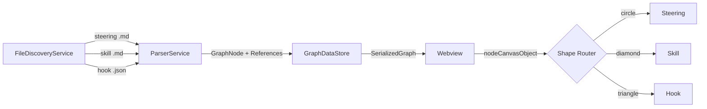

# Design Document: Ecosystem Graph — Skills & Hooks

## Overview

This feature extends the Ecosystem Graph VS Code extension to discover, parse, classify, and render two new Kiro concepts: **Skills** (`.kiro/skills/*.md`) and **Hooks** (`.kiro/hooks/*.json`). Skills are markdown files defining agent capabilities; hooks are JSON files defining automated triggers. The extension currently handles only steering files (`.kiro/steering/*.md`) — this design adds support for the two new file categories while preserving all existing behavior.

The key architectural change is generalizing the single-pattern discovery/parsing pipeline into a multi-pattern pipeline that handles three distinct file categories with different parsing strategies (markdown for steerings/skills, JSON for hooks) and different rendering shapes (circles for steerings, diamonds for skills, triangles for hooks).

## Architecture

The existing pipeline flows as:

```
FileDiscoveryService → ParserService → GraphDataStore → Webview (force-graph)
         ↓                   ↓                ↓
   glob patterns       regex extraction    node/edge store
```

The new architecture extends each stage:



**Design decisions:**

1. **FileDiscoveryService** gains two additional glob patterns. The `discoverAll()` method runs three `findFiles` calls and merges results. Each result carries a `fileCategory` discriminator (`steering` | `skill` | `hook`) so the parser knows which strategy to apply.
2. **ParserService** gains a `parseHook()` method for JSON files. Skill files reuse the existing markdown parsing logic since they share the same reference format.
3. **NodeClassifier** is bypassed for skills/hooks — their NodeType is determined by file location and JSON content, not filename prefix matching.
4. **Webview** `nodeCanvasObject` gains a shape-switching `if/else` based on `node.type` prefix.

## Components and Interfaces

### Extended Types (`types.ts`)

```typescript
// Add to NodeType union:
export type NodeType =
  | 'steering-flow'
  | 'steering-help'
  | 'steering-playbook'
  | 'steering-observability'
  | 'steering-domain'
  | 'steering-policy'
  | 'steering-tech'
  | 'steering-product'
  | 'steering-agent'
  | 'code-file'
  | 'module'
  | 'entity'
  | 'skill'
  | 'hook-manual'
  | 'hook-auto'
  | 'unknown';

// New: file category discriminator for discovery results
export type FileCategory = 'steering' | 'skill' | 'hook';

// Extend SteeringFile (rename conceptually to EcosystemFile)
export interface EcosystemFile {
  uri: vscode.Uri;
  workspaceFolder: string;
  relativePath: string;
  category: FileCategory;
}
```

### FileDiscoveryService Changes

```typescript
// New method signature (replaces single-pattern approach)
async discoverAll(): Promise<EcosystemFile[]> {
  const patterns = [
    { glob: '**/.kiro/steering/*.md', category: 'steering' },
    { glob: '**/.kiro/skills/*.md', category: 'skill' },
    { glob: '**/.kiro/hooks/*.json', category: 'hook' },
  ];
  // Run all three findFiles in parallel, merge results
}
```

The file watcher creates three `FileSystemWatcher` instances (one per glob pattern) and emits unified `FileChangeEvent` objects with the `category` field.

### ParserService Changes

```typescript
// New public method for hook files
parseHook(file: EcosystemFile, content: string, knownFiles: Map<string, string>): ParseResult {
  // 1. JSON.parse(content) — wrapped in try/catch
  // 2. Extract name, when.type, then.prompt
  // 3. Determine NodeType: when.type === 'userTriggered' ? 'hook-manual' : 'hook-auto'
  // 4. Scan then.prompt for known steering filenames → create References
  // 5. Return { node, references }
}

// Skill files use existing parse() with NodeType forced to 'skill'
parseSkill(file: EcosystemFile, content: string, knownFiles: Map<string, string>): ParseResult {
  // Reuse markdown reference extraction
  // Force node.type = 'skill'
}
```

### NodeClassifier Changes

Add three entries to `NODE_COLOR_MAP`:

```typescript
const NODE_COLOR_MAP: Record<NodeType, string> = {
  // ... existing entries unchanged ...
  'skill': '#B388FF',
  'hook-manual': '#64B5F6',
  'hook-auto': '#7C4DFF',
};
```

### Webview Rendering Changes

The `nodeCanvasObject` callback gains shape-switching logic:

```javascript
// Inside nodeCanvasObject:
if (node.type === 'skill') {
  // Diamond: rotated square (45 degrees)
  ctx.save();
  ctx.translate(node.x, node.y);
  ctx.rotate(Math.PI / 4);
  ctx.beginPath();
  ctx.rect(-size, -size, size * 2, size * 2);
  ctx.fillStyle = color;
  ctx.fill();
  ctx.restore();
} else if (node.type === 'hook-manual' || node.type === 'hook-auto') {
  // Equilateral triangle
  var h = size * 2;
  ctx.beginPath();
  ctx.moveTo(node.x, node.y - h * 0.6);
  ctx.lineTo(node.x - h * 0.55, node.y + h * 0.4);
  ctx.lineTo(node.x + h * 0.55, node.y + h * 0.4);
  ctx.closePath();
  ctx.fillStyle = color;
  ctx.fill();
} else {
  // Circle (existing steerings, code-file, etc.)
  ctx.beginPath();
  ctx.arc(node.x, node.y, size, 0, 2 * Math.PI);
  ctx.fillStyle = color;
  ctx.fill();
}
```

### Filter Panel

The filter panel already dynamically builds toggles from `graphData.nodes` types present in the data. Since it iterates all unique `node.type` values and looks up `COLOR_MAP[type]`, the new types will auto-appear as toggle buttons once:
1. `COLOR_MAP` includes entries for `skill`, `hook-manual`, `hook-auto`
2. Nodes of those types exist in the graph data

No structural changes to `filter-panel.js` are needed — only the `COLOR_MAP` constant in `webview.js` needs the three new entries.

## Data Models

### Hook JSON Schema (input format)

```json
{
  "name": "Auto-format on save",
  "description": "Formats code when a file is saved",
  "when": {
    "type": "fileEdited",
    "pattern": "**/*.ts"
  },
  "then": {
    "prompt": "Format this file following the conventions in `code-conventions.md` and apply the rules from `help-formatting.md`."
  }
}
```

Key fields for parsing:
- `name` → node label (fallback: filename without `.json`)
- `when.type` → `'userTriggered'` means `hook-manual`, anything else means `hook-auto`
- `then.prompt` → scanned for known steering filenames (backtick-wrapped or bare `.md` references)

### Extended GraphNode (no schema change)

The existing `GraphNode` interface already supports all needed fields. The `type` field carries the new `NodeType` values. No new metadata fields are required for skills/hooks in this iteration.

### COLOR_MAP Extension (webview)

```javascript
const COLOR_MAP = {
  // ... existing 13 entries unchanged ...
  'skill': '#B388FF',
  'hook-manual': '#64B5F6',
  'hook-auto': '#7C4DFF',
};
```


## Correctness Properties

*A property is a characteristic or behavior that should hold true across all valid executions of a system — essentially, a formal statement about what the system should do. Properties serve as the bridge between human-readable specifications and machine-verifiable correctness guarantees.*

### Property 1: File descriptor structure completeness

*For any* file discovered by `FileDiscoveryService` (regardless of category: steering, skill, or hook), the resulting descriptor SHALL contain a non-empty `uri`, a non-empty `workspaceFolder` string, a non-empty `relativePath` string, and a valid `category` value.

**Validates: Requirements 1.2, 2.2**

### Property 2: Skill files produce skill NodeType

*For any* file with a path matching `.kiro/skills/*.md`, when parsed by the ParserService, the resulting `GraphNode.type` SHALL equal `'skill'`.

**Validates: Requirements 3.2, 5.1**

### Property 3: Hook type determination from when.type

*For any* valid hook JSON object, if `when.type === 'userTriggered'` then the resulting `GraphNode.type` SHALL equal `'hook-manual'`; otherwise it SHALL equal `'hook-auto'`.

**Validates: Requirements 4.2, 4.3, 5.2, 5.3**

### Property 4: Hook parsing round-trip

*For any* valid hook JSON object, parsing it to extract a `GraphNode` and then reconstructing the classification-relevant fields (`name`, `when.type`) and re-parsing SHALL produce an equivalent `GraphNode` (same `type`, same `label`).

**Validates: Requirements 4.7**

### Property 5: Reference extraction from skill markdown

*For any* skill markdown content containing wiki-links, markdown-links, backtick-refs, or table-paths, the ParserService SHALL extract the same set of references as it would for an equivalent steering file with identical content.

**Validates: Requirements 3.1, 3.3**

### Property 6: Reference extraction from hook prompt

*For any* hook JSON where `then.prompt` contains one or more known steering filenames (with or without `.md` extension, with or without backticks), the ParserService SHALL produce one `Reference` edge per mentioned filename, with `source` equal to the hook's relative path and `target` equal to the steering file's relative path.

**Validates: Requirements 4.4**

### Property 7: Label derivation for skills and hooks

*For any* skill file, the node label SHALL equal the filename without the `.md` extension. *For any* hook file, the node label SHALL equal the `name` field from the JSON if present and non-empty, otherwise the filename without the `.json` extension.

**Validates: Requirements 3.4, 4.6**

### Property 8: Node sizing is type-agnostic

*For any* two nodes with the same degree (number of connections), `getNodeSize()` SHALL return the same value regardless of their `NodeType` (skill, hook-manual, hook-auto, or any steering type).

**Validates: Requirements 6.3, 7.5**

### Property 9: Filter visibility matches visibleTypes set

*For any* graph containing nodes of mixed types and any subset of types in `visibleTypes`, after applying filters, a node SHALL be visible if and only if its `type` is included in the `visibleTypes` set.

**Validates: Requirements 8.4, 8.5**

### Property 10: Steering classification backward compatibility

*For any* steering filename that was classifiable before this change, the `NodeClassifier.classify()` method SHALL return the same `NodeType` as the previous implementation.

**Validates: Requirements 10.3, 5.7**

### Property 11: Steering parsing backward compatibility

*For any* steering file content, the `ParserService.parse()` method SHALL produce the same set of `Reference` objects (same source, target, type, line) as the previous implementation.

**Validates: Requirements 10.2**

## Error Handling

| Scenario | Handling |
|----------|----------|
| Hook file contains invalid JSON | `parseHook()` catches `SyntaxError`, logs a warning via `console.warn`, returns `null`. The file is skipped — no node or edges are added. |
| Hook file missing `when` or `when.type` field | Defaults to `'hook-auto'` (safest assumption: if we can't determine trigger type, treat as automatic). |
| Hook file missing `then.prompt` field | Node is created with no outgoing edges. No references extracted. |
| Hook file missing `name` field | Falls back to filename without `.json` extension as label. |
| Skill file fails to open (permission error) | Same handling as existing steering files — caught in `initializeGraph`, file skipped silently. |
| `findFiles` returns empty for a pattern | Normal case (workspace has no skills/hooks). No error, empty array merged. |
| File watcher fails to create | Logged as warning. Graph still works with initial discovery data, just won't get live updates for that pattern. |

## Testing Strategy

### Property-Based Testing

**Library:** [fast-check](https://github.com/dubzzz/fast-check) (already standard for TypeScript PBT)

**Configuration:**
- Minimum 100 iterations per property test
- Each test tagged with: `Feature: ecosystem-graph-skills-hooks, Property {N}: {title}`

**Properties to implement as PBT:**

| Property | Generator Strategy |
|----------|-------------------|
| P1: File descriptor structure | Generate random workspace folder names and file paths matching each glob pattern |
| P2: Skill NodeType | Generate random `.kiro/skills/*.md` paths |
| P3: Hook type determination | Generate random hook JSON with arbitrary `when.type` values |
| P4: Hook round-trip | Generate random valid hook JSON objects |
| P5: Skill reference extraction | Generate random markdown with embedded reference patterns |
| P6: Hook prompt references | Generate random `then.prompt` strings with embedded steering filenames |
| P7: Label derivation | Generate random filenames and JSON name fields (including empty/absent) |
| P8: Node sizing | Generate pairs of nodes with same degree but different NodeTypes |
| P9: Filter visibility | Generate random node sets and random visibleTypes subsets |
| P10: Steering classification | Generate random steering filenames matching known prefix patterns |
| P11: Steering parsing | Generate random markdown content with mixed reference types |

### Unit Tests (Examples and Edge Cases)

- Invalid JSON hook file → returns null, no crash
- Hook with `when.type: 'userTriggered'` → `hook-manual`
- Hook with `when.type: 'fileEdited'` → `hook-auto`
- Hook with missing `name` → label falls back to filename
- Hook prompt mentioning `help-faq.md` → creates edge to steering
- Hook prompt mentioning `help-faq` (no extension) → creates edge to steering
- Skill file with no references → node created, zero edges
- COLOR_MAP contains all 16 entries (13 existing + 3 new)
- NODE_COLOR_MAP contains all 16 entries
- Existing steering files still classified identically (regression)
- Filter panel shows new types when nodes exist in data
- `getNodeSize` returns same value for skill and steering nodes with equal degree

### Integration Tests

- Full pipeline: discover → parse → store → serialize for a workspace with all three file types
- File watcher emits events for `.kiro/hooks/*.json` creation
- Webview receives `updateGraph` with skill and hook nodes included

