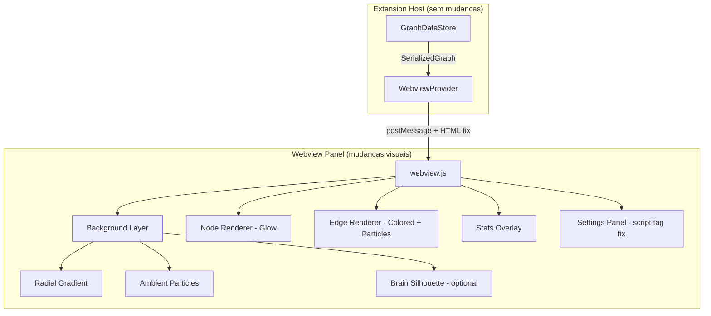

# Design Document: Ecosystem Graph Visual Upgrade

## Overview

Este upgrade transforma a visualizacao do Ecosystem Graph de um grafo funcional basico para uma experiencia visual de rede neural — um cerebro digital vivo onde nodes sao sinapses brilhantes, edges sao caminhos neurais com impulsos eletricos, e o ambiente transmite profundidade cosmica.

O upgrade e puramente visual e comportamental — nao altera a arquitetura de parsing, discovery, ou data store. As mudancas se concentram em:

1. **webview.js** — rendering pipeline (glow, particles, background, sizing, colors, stats)
2. **webviewProvider.ts** — inclusao do script settings-panel.js no HTML
3. **settings-panel.js** — nenhuma mudanca estrutural (ja funciona, so precisa ser carregado)
4. **nodeClassifier.ts** — ajuste de regras de classificacao para cobrir mais patterns

### Decisoes de Design

- **Canvas 2D shadowBlur para glow**: Nativo do Canvas, sem dependencias extras, performance aceitavel para <200 nodes
- **force-graph linkDirectionalParticles**: Feature nativa da lib force-graph para particulas em edges — zero codigo custom de animacao
- **Background via canvas pre-render**: Radial gradient e ambient particles renderizados em layer separada (canvas background callback), sem DOM extra
- **Continuous simulation via alphaDecay baixo**: Em vez de timer custom, usa o proprio d3-force com decay quase zero para movimento organico perpetuo
- **Edge weight via contagem de edges duplicados**: Agrupa edges source→target iguais em um unico edge com weight, renderizado mais grosso
- **Stats overlay via DOM element**: Simples div posicionado, atualizado no handleUpdateGraph — sem complexidade de canvas text

## Architecture



### Fluxo de Rendering (por frame)

1. **Background**: Canvas pre-paint callback renderiza radial glow + ambient particles
2. **Edges**: force-graph renderiza edges com cor do source node + directional particles
3. **Nodes**: Custom nodeCanvasObject renderiza glow (shadowBlur) + circle + label
4. **Overlay DOM**: Stats indicator atualiza via DOM (fora do canvas)

## Components and Interfaces

### 1. WebviewProvider (mudanca minima)

Unica mudanca: adicionar o `<script>` tag do settings-panel.js que esta declarado mas nao incluido no HTML.

```typescript
// Antes (HTML atual): falta o script tag do settings-panel
// Depois: adicionar antes do </body>
`<script nonce="${nonce}" src="${settingsPanelUri}"></script>`
```

### 2. webview.js — Visual Configuration

Novas constantes e configuracao visual:

```javascript
// Background
const BG_COLOR = '#0d0d0d';
const RADIAL_GLOW_COLOR = 'rgba(26, 58, 92, 0.15)';
const AMBIENT_PARTICLE_COUNT = 45; // 30-60 range
const AMBIENT_PARTICLE_SIZE_MIN = 0.5;
const AMBIENT_PARTICLE_SIZE_MAX = 1.5;
const AMBIENT_PARTICLE_OPACITY_MIN = 0.1;
const AMBIENT_PARTICLE_OPACITY_MAX = 0.3;

// Node Glow
const NODE_BASE_SIZE = 4;
const NODE_SCALE_FACTOR = 1.5;
const GLOW_MIN_BLUR = 8;
const GLOW_MAX_BLUR = 20;

// Labels
const LABEL_ZOOM_THRESHOLD = 1.5;

// Edges
const EDGE_DEFAULT_OPACITY = 0.12;
const EDGE_HOVER_OPACITY = 0.7;
const EDGE_DEFAULT_WIDTH = 0.5;
const EDGE_HOVER_WIDTH = 1.5;
const PARTICLE_COUNT_BASE = 1;
const PARTICLE_COUNT_MAX = 3;
const PARTICLE_SPEED = 0.008;
const PARTICLE_SIZE = 1.5;

// Simulation
const COOLDOWN_TIME = Infinity;
const ALPHA_DECAY = 0.005;
const WARMUP_TICKS = 100;
const VELOCITY_DECAY = 0.4;
```

### 3. webview.js — Ambient Particles System

```javascript
/**
 * Array of ambient background particles.
 * Each particle has: x, y, size, opacity, vx, vy (velocity for drift)
 */
let ambientParticles = [];

function initAmbientParticles(width, height) { /* ... */ }
function updateAmbientParticles(width, height) { /* ... */ }
function renderAmbientParticles(ctx, width, height) { /* ... */ }
```

### 4. webview.js — Edge Weight Calculation

```javascript
/**
 * Pre-compute edge weights (number of duplicate source→target pairs).
 * Collapses duplicate edges into single weighted edges.
 * @param {Array} links - Raw links from graph data
 * @returns {Array} Deduplicated links with weight property
 */
function computeEdgeWeights(links) { /* ... */ }
```

### 5. webview.js — Stats Overlay

```javascript
/**
 * Update the ecosystem stats indicator (bottom-left).
 * Format: "N nodes · M edges · K types"
 */
function updateStats(nodes, edges) { /* ... */ }
```

### 6. nodeClassifier.ts — Extended Rules

Adicionar classificacao para arquivos de configuracao/regras que atualmente caem em `steering-domain` via pattern matching mais especifico:

```typescript
// Existing patterns already cover this via the 'convention', 'regra', 'persona',
// 'security', 'cognitive', 'auto-aprendizado' checks.
// No structural change needed — just verify coverage matches Requirement 12.
```

### 7. force-graph Configuration Changes

```javascript
// Simulation parameters
graph
  .cooldownTime(Infinity)
  .warmupTicks(100)
  .d3AlphaDecay(0.005)
  .d3VelocityDecay(0.4)
  .backgroundColor('#0d0d0d')
  // Directional particles on edges
  .linkDirectionalParticles(node => getParticleCount(node))
  .linkDirectionalParticleSpeed(0.008)
  .linkDirectionalParticleWidth(1.5)
  .linkDirectionalParticleColor(link => getSourceColor(link))
```

## Data Models

### Edge Weight Model

Edges com multiplas referencias entre os mesmos nodes sao colapsados:

```javascript
// Input: raw edges from SerializedGraph
[
  { source: 'A', target: 'B', type: 'wiki-link' },
  { source: 'A', target: 'B', type: 'markdown-link' },
  { source: 'A', target: 'B', type: 'backtick-ref' },
]

// Output: weighted edge for rendering
{ source: 'A', target: 'B', weight: 3 }
```

O weight influencia:
- **Largura do edge**: `EDGE_DEFAULT_WIDTH * (1 + (weight - 1) * 0.3)`
- **Numero de particulas**: `min(weight, PARTICLE_COUNT_MAX)`

### Ambient Particle Model

```javascript
{
  x: number,       // position (0 to canvas.width)
  y: number,       // position (0 to canvas.height)
  size: number,    // radius (0.5 - 1.5 px)
  opacity: number, // alpha (0.1 - 0.3)
  vx: number,      // horizontal drift velocity (-0.1 to 0.1 px/frame)
  vy: number,      // vertical drift velocity (-0.1 to 0.1 px/frame)
}
```

### Stats Display Model

```javascript
{
  nodeCount: number,
  edgeCount: number,
  typeCount: number,  // number of distinct NodeTypes present
}
```

### Visual Constants Summary

| Parameter | Old Value | New Value | Rationale |
|-----------|-----------|-----------|-----------|
| backgroundColor | #1e1e1e | #0d0d0d | Deep black for neural cosmos feel |
| NODE_BASE_SIZE | 3 | 4 | Larger minimum for glow visibility |
| NODE_SCALE_FACTOR | 0.4 | 1.5 | Dramatic size difference by degree |
| LABEL_ZOOM_THRESHOLD | 1.8 | 1.5 | Labels visible earlier |
| cooldownTime | 4000 | Infinity | Never-ending simulation |
| d3AlphaDecay | 0.0228 | 0.005 | Slow decay = continuous motion |
| warmupTicks | 150 | 100 | Slightly faster initial layout |
| centerForce default | 1 | 0.05 | Gentle pull, not aggressive |
| repulsionForce default | -100 | -150 | Better cluster separation |
| linkDistance default | 80 | 60 | Tighter connected clusters |
| linkWidth default | 0.4 | 0.5 | Slightly more visible edges |

### Settings Panel Defaults (corrected)

```javascript
let settings = {
  centerForce: 0.05,      // was 1
  repulsionForce: -150,   // was -100
  linkForce: 0.3,         // unchanged
  linkDistance: 60,        // was 80
  nodeSizeMultiplier: 1,  // unchanged
  linkWidth: 0.5,         // was 0.4
  showArrows: false,      // unchanged
  labelMode: 'auto',      // unchanged
  showOnlyExisting: false, // unchanged
  showOrphans: true,      // unchanged
};
```


## Correctness Properties

*A property is a characteristic or behavior that should hold true across all valid executions of a system — essentially, a formal statement about what the system should do. Properties serve as the bridge between human-readable specifications and machine-verifiable correctness guarantees.*

### Property 1: Node size formula correctness

*For any* node degree (0 to 50) and any nodeSizeMultiplier (0.5 to 3.0), the computed node size shall equal `(4 + degree * 1.5) * nodeSizeMultiplier`, and the result shall always be positive. Additionally, for any two degrees where d1 > d2, size(d1) > size(d2) (monotonically increasing).

**Validates: Requirements 4.1, 4.2, 4.3, 4.4**

### Property 2: Glow blur bounded by node size

*For any* node degree (0 to 50), the computed shadowBlur value shall be between 8 (minimum) and 20 (maximum), inclusive. The blur shall scale proportionally with degree within these bounds.

**Validates: Requirements 3.2**

### Property 3: Glow color matches node type color

*For any* node with a valid NodeType, the shadowColor used for glow rendering shall equal the hex color from COLOR_MAP for that NodeType. No node shall have a glow color that differs from its type color.

**Validates: Requirements 3.3**

### Property 4: Label visibility logic

*For any* zoom level (0.3 to 8.0) and any labelMode ('on', 'off', 'auto'), the shouldShowLabel function shall return: true if labelMode is 'on', false if labelMode is 'off', and (zoom > 1.5) if labelMode is 'auto'.

**Validates: Requirements 7.1, 7.2, 7.3, 7.4**

### Property 5: Edge color derived from source node type

*For any* edge in the graph, the computed edge color shall equal the COLOR_MAP color of the source node's type. The particle color on that edge shall also equal the same source node color.

**Validates: Requirements 8.5, 9.1, 9.3**

### Property 6: Edge weight computation collapses duplicates

*For any* set of raw edges (with possible duplicates of the same source→target pair), the computeEdgeWeights function shall produce a deduplicated set where each unique source→target pair appears exactly once, with a weight equal to the count of original edges for that pair. The total weight across all output edges shall equal the count of input edges.

**Validates: Requirements 8.7**

### Property 7: Particle count bounded by edge weight

*For any* edge with weight W (1 to N), the number of directional particles shall be `min(W, 3)` — at least 1 and at most 3.

**Validates: Requirements 8.6**

### Property 8: Ambient particle initialization within bounds

*For any* canvas dimensions (width > 0, height > 0), initializing ambient particles shall produce between 30 and 60 particles, each with: position within canvas bounds (0 <= x <= width, 0 <= y <= height), size between 0.5 and 1.5 px, opacity between 0.1 and 0.3, and non-zero independent velocity vectors.

**Validates: Requirements 2.3, 2.4**

### Property 9: Node classifier prefix-based classification

*For any* filename starting with "flow-", classify returns 'steering-flow'. *For any* filename starting with "help-", classify returns 'steering-help'. *For any* filename starting with "playbook", classify returns 'steering-playbook'. *For any* filename starting with "observability-", classify returns 'steering-observability'. *For any* filename containing "-dominio" or "-domain", classify returns 'steering-domain'. *For any* filename matching config patterns (persona, regras, convention, security, cognitive, auto-aprendizado), classify returns 'steering-domain'. *For any* non-.md file from a code workspace folder, classify returns 'code-file'. *For any* filename matching no rule, classify returns 'unknown'.

**Validates: Requirements 12.1, 12.2, 12.3, 12.4, 12.5, 12.6, 12.7, 12.8**

### Property 10: Color map injectivity

*For any* two distinct NodeTypes in the COLOR_MAP, their assigned colors shall be different. The mapping from NodeType to color is injective (no color collisions).

**Validates: Requirements 12.9**

### Property 11: Stats computation correctness

*For any* graph data with N nodes, M edges, and K distinct node types, the stats computation shall produce exactly those counts, and the formatted string shall contain all three numbers.

**Validates: Requirements 11.1, 11.3**

### Property 12: Settings update applies value to settings object

*For any* valid setting key and value within its defined range, calling updateSetting(key, value) shall result in settings[key] equaling the provided value.

**Validates: Requirements 1.5**

## Error Handling

### Rendering Errors

- **Canvas context unavailable**: Se o canvas 2D context nao estiver disponivel (raro em webview), o force-graph falha silenciosamente. Nao ha fallback — o grafo simplesmente nao renderiza.
- **Ambient particles on zero-size canvas**: Se width ou height for 0 (panel minimizado), skip particle rendering. Reinicializar quando resize detectar dimensoes validas.
- **NaN in node positions**: force-graph pode produzir NaN se forcas forem extremas. O d3VelocityDecay de 0.4 previne isso. Se ocorrer, nodes ficam em (0,0) — nao crash.

### Edge Weight Computation

- **Zero edges**: Retorna array vazio. Stats mostra "0 edges".
- **Self-referencing edges** (source === target): Incluidos no weight computation normalmente. force-graph renderiza como loop.
- **Missing source node for edge color**: Se o source node nao existir no graphData.nodes (edge orfao), fallback para cor '#607D8B' (unknown gray).

### Settings Panel

- **Script not loaded** (CSP block): Se o nonce estiver incorreto, settings-panel.js nao executa. O grafo funciona normalmente sem o panel — apenas os controles ficam indisponiveis. Console mostra CSP violation.
- **Invalid slider value**: Sliders tem min/max no HTML. Valores fora do range sao clamped pelo browser. Nao precisa de validacao extra.
- **Saved state with old schema**: Se o saved state tiver keys que nao existem mais, o spread `{ ...defaults, ...saved }` ignora keys extras e mantem defaults para keys ausentes.

### Stats Overlay

- **Graph data not yet loaded**: Stats mostra "0 nodes · 0 edges · 0 types" ate o primeiro updateGraph chegar.
- **Rapid updates**: Stats atualiza sincronamente no handleUpdateGraph. Nao ha debounce — cada update reflete imediatamente.

### NodeClassifier

- **Empty filename**: Retorna 'unknown'. Nao throw.
- **Filename with multiple matching prefixes** (ex: "flow-observability-x.md"): Primeira regra que bate ganha (flow- tem prioridade sobre observability- por ordem de checagem).

## Testing Strategy

### Abordagem Dual: Unit Tests + Property-Based Tests

O upgrade usa duas camadas complementares:

1. **Unit tests** (Mocha + assert): exemplos especificos de configuracao, edge cases, integracao
2. **Property-based tests** (fast-check): propriedades universais com inputs gerados

### Property-Based Testing

- **Biblioteca**: `fast-check` (ja presente em devDependencies do package.json)
- **Configuracao**: minimo 100 iteracoes por property test
- **Tag format**: `Feature: ecosystem-graph-visual-upgrade, Property {N}: {title}`
- **Cada correctness property DEVE ser implementada por UM UNICO property-based test**

### Unit Tests

Focam em:
- Verificacao de constantes (background color, defaults, thresholds)
- Configuracao do force-graph (cooldownTime, alphaDecay, warmupTicks)
- HTML output do webviewProvider (script tags presentes)
- Edge cases: 0 nodes, 0 edges, single node, self-referencing edge
- Stats formatting com valores especificos

### Estrutura de Testes

```
src/test/
  unit/
    visual-config.test.ts     - Constantes e defaults (Req 2.1, 5.1-5.4, 6.1-6.6)
    webview-html.test.ts      - Script tags no HTML (Req 1.1)
    click-to-open.test.ts     - Verificacao de click handler (Req 10.1-10.4)
  property/
    node-sizing.property.ts   - Property 1: formula de tamanho
    glow.property.ts          - Properties 2, 3: blur bounds e color
    labels.property.ts        - Property 4: visibilidade de labels
    edge-color.property.ts    - Property 5: cor do edge = source color
    edge-weight.property.ts   - Property 6: deduplicacao e weight
    particles.property.ts     - Properties 7, 8: particle count e ambient particles
    classifier.property.ts    - Properties 9, 10: classificacao e injectividade
    stats.property.ts         - Property 11: computacao de stats
    settings.property.ts      - Property 12: updateSetting aplica valor
```

### Generators (fast-check)

Generators customizados necessarios:

- `arbNodeDegree()`: inteiro 0-50
- `arbNodeSizeMultiplier()`: float 0.5-3.0
- `arbZoomLevel()`: float 0.3-8.0
- `arbLabelMode()`: oneof('on', 'off', 'auto')
- `arbNodeType()`: oneof(...all NodeTypes)
- `arbEdgeList(maxSize)`: array de edges com source/target aleatorios (permite duplicatas)
- `arbCanvasDimensions()`: { width: 100-2000, height: 100-2000 }
- `arbSteeringFileName()`: gera nomes com prefixos conhecidos (flow-*, help-*, etc.)
- `arbSettingKey()`: oneof(...all setting keys)
- `arbSettingValue(key)`: valor valido para o range do setting key
- `arbGraphData()`: { nodes: GraphNode[], edges: GraphEdge[] } com tipos e folders variados

### Cobertura por Requirement

| Requirement | Unit Tests | Property Tests |
|-------------|-----------|----------------|
| 1 (Settings Panel) | HTML script tag | Property 12 |
| 2 (Background) | Constants check | Property 8 |
| 3 (Node Glow) | - | Properties 2, 3 |
| 4 (Node Sizing) | - | Property 1 |
| 5 (Continuous Sim) | Config values | - |
| 6 (Force Params) | Default values | - |
| 7 (Label Threshold) | - | Property 4 |
| 8 (Edge Particles) | Config check | Properties 5, 6, 7 |
| 9 (Edge Colors) | - | Property 5 |
| 10 (Click-to-Open) | Integration examples | - |
| 11 (Stats) | Format examples | Property 11 |
| 12 (NodeTypes) | - | Properties 9, 10 |
