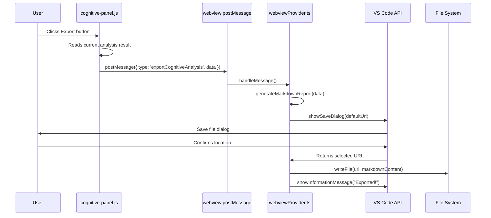

# Design Document: Export Cognitive Analysis

## Overview

This feature adds a Markdown export capability to the existing Cognitive Analysis panel. When the user clicks an export button, the webview collects the current analysis results, sends them to the extension host via `postMessage`, and the extension host generates a structured Markdown report and presents a save dialog. The exported file is designed to be pasted directly into Kiro AI chat for automated resolution of identified issues.

The flow is: **Webview (cognitive-panel.js)** → `postMessage` → **Extension Host (webviewProvider.ts)** → **Save Dialog** → **File System**.

## Architecture



### Design Decisions

1. **Reuse existing message pattern**: The extension already handles `exportImage` via the same webview→extension postMessage channel. We follow the identical pattern for `exportCognitiveAnalysis`.
2. **Save dialog instead of fixed path**: Unlike `exportImage` which writes directly to workspace root, this feature uses `vscode.window.showSaveDialog` to give the user control over file placement — the report is meant to be shared or pasted, not just stored.
3. **Report generation in extension host**: Markdown generation happens server-side (extension host) rather than in the webview, keeping the webview lightweight and giving access to Node.js `Date` formatting and VS Code workspace context.
4. **No new service class**: The report generation is a pure function (data in → string out) with no state. It lives as a utility function in a new file `src/services/markdownReportGenerator.ts` rather than a full service class.

## Components and Interfaces

### 1. Webview: Export Button & Message Dispatch (cognitive-panel.js)

The existing `CognitivePanel` IIFE gains:
- An export button element appended to the panel header (next to the title)
- The button is visible only when `analysis !== null`
- On click, it calls `vscode.postMessage({ type: 'exportCognitiveAnalysis', data: analysis })`

### 2. Message Protocol (types.ts)

Add a new variant to the `WebviewMessage` union type:

```typescript
| { type: 'exportCognitiveAnalysis'; data: CognitiveAnalysisResult | null }
```

Add a new interface for the analysis data shape:

```typescript
export interface CognitiveAnalysisResult {
  steeringsSoltos: { id: string; label: string }[];
  vinculosFrageis: { source: string; target: string; sourceLabel: string; targetLabel: string }[];
  arquivosSemContexto: { id: string; label: string; type: string }[];
  coverageGaps: { folder: string }[];
  sugestoes: string[];
}
```

### 3. Extension Host: Message Handler (webviewProvider.ts)

Add a new case to the `handleMessage` switch:

```typescript
case 'exportCognitiveAnalysis':
  this.handleExportCognitiveAnalysis(message.data);
  break;
```

### 4. Markdown Report Generator (src/services/markdownReportGenerator.ts)

A pure function:

```typescript
export function generateCognitiveReport(data: CognitiveAnalysisResult): string
```

Takes the analysis result and returns a complete Markdown string.

### 5. File Save Handler (webviewProvider.ts)

The `handleExportCognitiveAnalysis` method:
1. Validates `data` is non-null and non-empty
2. Calls `generateCognitiveReport(data)`
3. Shows save dialog with default filename `cognitive-analysis-YYYY-MM-DD.md`
4. Writes file on confirmation, shows info message
5. Silently aborts on cancel
6. Shows warning on write error

## Data Models

### CognitiveAnalysisResult

This interface mirrors the object returned by `CognitivePanel.computeAnalysis()` in the webview:

```typescript
export interface CognitiveAnalysisResult {
  /** Steering nodes with 0 incoming + 0 outgoing edges */
  steeringsSoltos: { id: string; label: string }[];
  /** Edges with weight=1 AND type='backtick-ref' */
  vinculosFrageis: { source: string; target: string; sourceLabel: string; targetLabel: string }[];
  /** Nodes with 0 total edges */
  arquivosSemContexto: { id: string; label: string; type: string }[];
  /** Workspace folders with 0 steering files */
  coverageGaps: { folder: string }[];
  /** Actionable recommendations */
  sugestoes: string[];
}
```

### Markdown Report Template

```markdown
# Cognitive Analysis Report

Generated: 2025-01-15T10:30:00Z

## Summary

| Metric | Count |
|--------|-------|
| Orphan Steerings | 3 |
| Fragile Links | 5 |
| Isolated Files | 2 |
| Coverage Gaps | 1 |

## Orphan Steerings

Steering files with no incoming or outgoing connections.

| File | Label | Tip |
|------|-------|-----|
| `path/to/steering-file.md` | My Steering | Add a reference to this file from a related steering using backtick syntax (e.g., \`steering-file.md\`) |
| ... | ... | ... |

## Fragile Links

Connections relying on a single backtick reference — one deletion breaks the link.

| Source | Target | Tip |
|--------|--------|-----|
| `source/file.md` | `target/file.md` | Add at least one additional cross-reference (wiki-link or markdown-link) between these files |
| ... | ... | ... |

## Isolated Files

Files with zero connections to the ecosystem — invisible to the AI agent.

| File | Label | Type | Tip |
|------|-------|------|-----|
| `path/to/file.md` | My File | steering-flow | Reference this file from the most relevant steering or skill file |
| ... | ... | ... | ... |

## Coverage Gaps

Workspace folders with no steering files — the AI has no context for these areas.

| Folder | Tip |
|--------|-----|
| `FolderName` | Create a steering file in `.kiro/steering/` covering this folder's domain |
| ... | ... |

## Recommendations

- Consider adding cross-references to the 3 orphan steering(s) to integrate them into the knowledge network.
- Strengthen the 5 fragile link(s) by adding additional cross-references between the connected nodes.
- Add context to the 2 isolated file(s) by referencing them in steerings or other ecosystem files.
- Create steering files for the 1 workspace folder(s) with no coverage.

## Instructions for Kiro AI

```text
Based on the cognitive analysis above, please resolve the identified issues:
1. For each Orphan Steering, add cross-references from related steerings to integrate them.
2. For each Fragile Link, add at least one additional reference (wiki-link or markdown-link) to strengthen the connection.
3. For each Isolated File, reference it from the most relevant steering file.
4. For each Coverage Gap, create a new steering file in the listed workspace folder.
Prioritize changes that increase overall graph connectivity.
```
```

### File Naming Convention

- Default filename: `cognitive-analysis-YYYY-MM-DD.md`
- Date uses local date from `new Date().toISOString().slice(0, 10)`
- Save dialog filter: `{ 'Markdown': ['md'] }`
- Default location: workspace root folder


## Correctness Properties

*A property is a characteristic or behavior that should hold true across all valid executions of a system — essentially, a formal statement about what the system should do. Properties serve as the bridge between human-readable specifications and machine-verifiable correctness guarantees.*

### Property 1: Report contains all input items

*For any* valid `CognitiveAnalysisResult` with non-empty arrays, the generated Markdown report should contain every item from the input: every orphan steering's `id`, every fragile link's `source` and `target`, every isolated file's `id` and `type`, every coverage gap's `folder`, and every suggestion string.

**Validates: Requirements 2.4, 2.5, 2.6, 2.7, 2.8, 4.4**

### Property 2: Summary counts match input lengths

*For any* valid `CognitiveAnalysisResult`, the generated Markdown report's Summary section should contain numeric strings equal to `steeringsSoltos.length`, `vinculosFrageis.length`, `arquivosSemContexto.length`, and `coverageGaps.length`.

**Validates: Requirements 2.3**

### Property 3: Report structural invariants

*For any* valid `CognitiveAnalysisResult`, the generated Markdown report should: (a) start with a level-1 heading containing "Cognitive Analysis Report", (b) contain a "Generated:" timestamp, (c) use level-2 headings for each section, (d) contain an "Instructions for Kiro AI" section, and (e) wrap the instructions prompt in a fenced code block.

**Validates: Requirements 2.2, 2.9, 4.1, 4.5**

### Property 4: File paths are backtick-formatted

*For any* valid `CognitiveAnalysisResult` containing file paths (orphan steerings, fragile links, isolated files), every file path that appears in the report body should be wrapped in backtick characters for inline code formatting.

**Validates: Requirements 4.2, 4.3**

### Property 5: Export button visibility tracks analysis state

*For any* analysis result that is non-null, the export button should be visible (display !== 'none'). When analysis is null, the export button should be hidden or disabled.

**Validates: Requirements 1.1, 1.2**

### Property 6: Null/empty data is rejected without side effects

*For any* message with `type: 'exportCognitiveAnalysis'` where `data` is null, undefined, or has all empty arrays, the handler should return early without invoking the save dialog or writing any file.

**Validates: Requirements 5.3**

## Error Handling

| Scenario | Handling |
|----------|----------|
| Analysis data is null/empty | Handler returns early, no dialog shown |
| User cancels save dialog | `showSaveDialog` returns `undefined`, handler aborts silently |
| File write fails (permissions, disk full) | Catch error, show `vscode.window.showWarningMessage` with failure text |
| Webview sends malformed data | Validate `data` shape before processing; ignore if invalid |

Error messages follow existing extension patterns:
- Success: `vscode.window.showInformationMessage('Cognitive analysis exported to {filename}')`
- Failure: `vscode.window.showWarningMessage('Failed to export cognitive analysis')`

## Testing Strategy

### Property-Based Tests (fast-check)

The project already uses `fast-check` (configured in `package.json`). Each correctness property maps to a single property-based test in `src/test/property/`.

**Configuration:**
- Minimum 100 iterations per property test (`fc.assert(property, { numRuns: 100 })`)
- Each test tagged with: `// Feature: export-cognitive-analysis, Property {N}: {title}`
- Test file: `src/test/property/cognitiveReport.property.ts`

**Generator strategy:**
- Generate random `CognitiveAnalysisResult` objects with arbitrary string arrays of varying lengths (0-20 items)
- File paths generated as random path-like strings (e.g., `folder/subfolder/file.md`)
- Labels generated as random non-empty strings
- Types generated from the `NodeType` union

**Properties to implement:**
1. `generateCognitiveReport` output contains all input items
2. Summary counts in output match input array lengths
3. Output always contains structural elements (title, timestamp, headings, instructions block)
4. All file paths in output are wrapped in backticks
5. Button visibility DOM state matches analysis nullability
6. Null/empty input causes early return (no report generated)

### Unit Tests (Mocha)

**Test file:** `src/test/unit/cognitiveReport.test.ts`

Focus on:
- Specific example: a known analysis result produces expected markdown output
- Edge case: all arrays empty → report still has structure but no item lists
- Edge case: special characters in file paths/labels are not corrupted
- Integration: `handleExportCognitiveAnalysis` calls save dialog with correct default filename format
- Integration: handler shows info message on success, warning on failure
- Integration: handler does nothing when dialog is cancelled

### Test Boundaries

- **Property tests** cover the pure `generateCognitiveReport` function (no VS Code API dependency)
- **Unit tests** cover the handler integration with mocked VS Code APIs (`showSaveDialog`, `writeFile`, `showInformationMessage`)
- **Manual testing** covers the webview button visibility and click behavior (DOM interaction in webview context)
